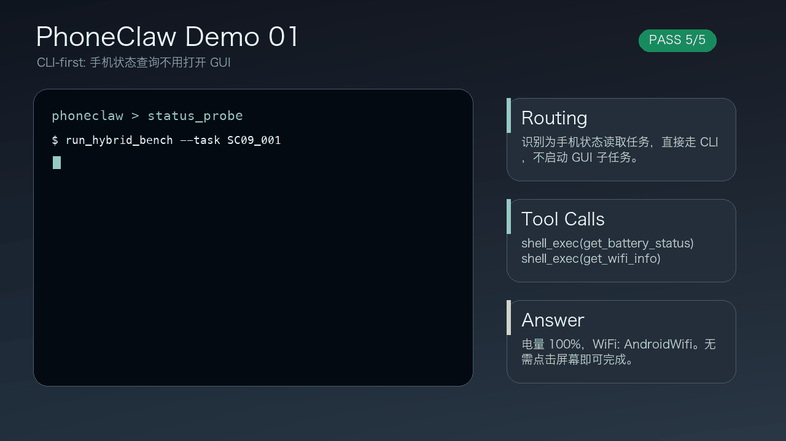
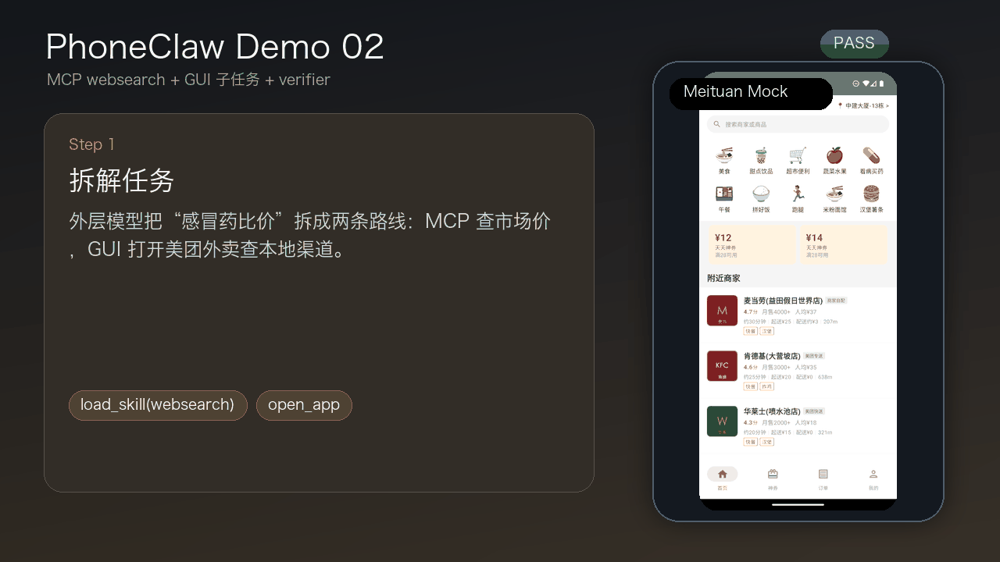
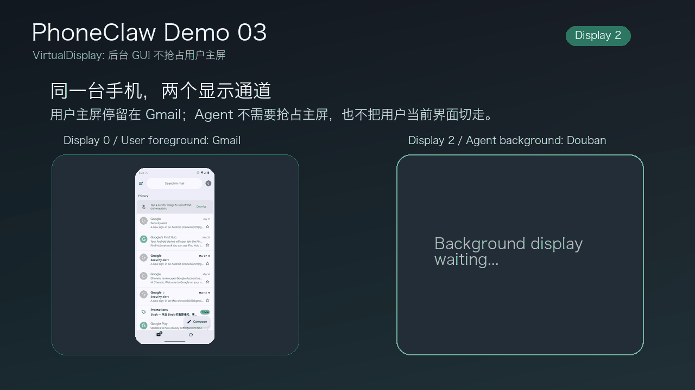

# PhoneHarness

<p align="center">
  <strong>🦾 A mixed-action orchestration harness and benchmark for phone agents across CLI, GUI, and MCP tools.</strong>
</p>

<p align="center">
  <em>✅ Evaluate phone agents by verifiable side effects, not only by the next tap.</em>
</p>

<p align="center">
  <a href="https://phoneharness.github.io">🏠 Homepage</a> •
  <a href="https://arxiv.org/abs/2606.14832">📄 Paper</a> •
  <a href="https://huggingface.co/datasets/PhoneHarness/phoneharness-bench">🤗 HF Dataset</a> •
  <a href="#-news">🗞️ News</a> •
  <a href="#-quick-start">🚀 Quick Start</a>
</p>

<p align="center">
  <a href="https://phoneharness.github.io"></a>
  <a href="https://arxiv.org/abs/2606.14832"></a>
  <a href="https://huggingface.co/datasets/PhoneHarness/phoneharness-bench"></a>
  
  
</p>

PhoneHarness is a phone-agent evaluation stack for workflows that cannot be represented as pure GUI navigation. Agents run against Android emulators, operate through device-side tools and host-side proxies, and are graded by verifiable evidence such as files, system settings, app state, and safety side-effect checks.

## 🚨🔥🗞️ News 🗞️🔥🚨

- 📱🤖✨ **[2026.05.29]** Phone-native agents are moving fast! We are tracking the latest phone-agent demos, native-phone workflows, and "metaverse-native phone" ideas as they land, because this space is now changing almost every day.
- 🚀📣🧠 **[2026.05.29]** We are excited to share Xinzhiyuan's coverage of the broader phone-agent wave and why GUI + tool + device-native orchestration is becoming so interesting: [read the WeChat article](https://mp.weixin.qq.com/s/I2ztL6sFiHGxAiCfh_FTqg).
- 🛠️📲⚡ **[2026.05.29]** Reproducible emulator setup is now documented: Pixel 6 / API 33 / 32G-data AVD, Termux, Termux:API, ADBKeyboard, app manifests, and PhoneHarness host-device port wiring.

More updates are collected in [`docs/news.md`](docs/news.md). Fresh phone-agent projects, papers, demos, and native-phone infrastructure are welcome!

## 🎬 Demos

<table>
  <tr>
    <td align="center"><strong>⚡ CLI-native status checks</strong></td>
    <td align="center"><strong>🧭 Hybrid GUI + tool workflow</strong></td>
    <td align="center"><strong>📱 Virtual-display control</strong></td>
  </tr>
  <tr>
    <td></td>
    <td></td>
    <td></td>
  </tr>
</table>

## ✨ Features

- 🧰 **Mixed action surface**: `shell_exec`, `python_exec`, `load_skill`, and `run_seed_gui_subtask` coexist in one phone-agent loop.
- 👀 **Delegated GUI control**: the outer orchestration model plans and calls tools, while a dedicated GUI worker handles screenshot-grounded app interaction.
- ⚙️ **Deterministic-first routing**: routing cards prefer CLI or MCP completion when a task has an exact executable path, and fall back to GUI only when needed.
- 🔍 **Trace-backed grading**: JSONL traces and HTML viewers make failures auditable as model reasoning errors, GUI grounding errors, environment faults, tool failures, or verifier mismatches.

## 📦 Benchmark

PhoneHarness Bench is released as a Hugging Face dataset:

https://huggingface.co/datasets/PhoneHarness/phoneharness-bench

The dataset contains the task definitions and metadata used by the paper. Keep generated traces and local run outputs out of git unless you intentionally publish an artifact snapshot.

## 🧩 Architecture

`PhoneHarness` is the public project name, `phoneharness` is the runtime Python package, and `PHONEHARNESS_*` is the standard environment-variable prefix.

```text
Host (macOS/Linux)                            Android Emulator + Termux
├── OpenAI-compatible model endpoint          ├── phoneharness server :8920
├── gui_proxy :8919 + slot*10                 ├── shell_exec / python_exec
│   screenshot, tap, swipe, type              ├── load_skill -> host tool proxy
└── trace viewers                             └── run_seed_gui_subtask -> GUI worker
```

The default mode is delegated:

```text
orchestration model (--model)
  ├── CLI and device operations
  ├── MCP / skill-backed host tools
  └── run_seed_gui_subtask(...)
        └── GUI model (--gui-model)
            └── screenshot-grounded app actions
```

## 🚀 Quick Start

For a reproducible Android Emulator environment, start with
[`docs/emulator-setup.md`](docs/emulator-setup.md). The reference setup is a
Pixel 6 / API 33 / 32G-data AVD with Termux, Termux:API, ADBKeyboard, and
PhoneHarness host/device port wiring via `scripts/create_avd.sh`,
`scripts/install_apps.sh`, and `scripts/setup_emulator.sh`.

### 1. 🔐 Configure model credentials

PhoneHarness expects OpenAI-compatible chat-completions endpoints. Export credentials in your shell or secret manager.

```bash
export OPENAI_BASE_URL="<openai-compatible-base-url>"
export OPENAI_API_KEY="<api-key>"
export PHONEHARNESS_GUI_API_URL="<optional-gui-model-base-url>"
export PHONEHARNESS_GUI_API_KEY="<optional-gui-model-api-key>"
```

### 2. 💻 Start a local console

```bash
python3 -m phoneharness console \
  --model "<orchestration-model>" \
  --gui-model "<gui-model>" \
  --base-url "$OPENAI_BASE_URL" \
  --api-key "$OPENAI_API_KEY"
```

### 3. 📱 Start an on-device server

```bash
python3 -m phoneharness server \
  --port 8920 \
  --model "<orchestration-model>" \
  --gui-model "<gui-model>" \
  --base-url "$OPENAI_BASE_URL" \
  --api-key "$OPENAI_API_KEY" \
  --skill-file skills/routing.yaml \
  --skill-file skills/index.yaml \
  --skill-file skills/file_output_paths.yaml
```

### 4. 🧾 Inspect traces

```bash
python3 scripts/trace2html.py path/to/trace.jsonl
python3 scripts/trace2html_all.py path/to/trace-directory
```

## 🗂️ Repository Layout

```text
phoneharness/
├── config/                  # Example app manifests for reproducible emulator setup
├── docs/                    # Demos and setup notes
├── phoneharness/            # Runtime package for the server, agent loop, tools, and GUI controllers
├── skills/                  # Runtime routing cards and progressive skill-disclosure YAMLs
├── scripts/                 # Emulator, GUI proxy, trace viewer, and helper scripts
├── tests/                   # Unit tests for adapters and harness behavior
└── vdisplay-helper/         # Virtual-display helper source
```
